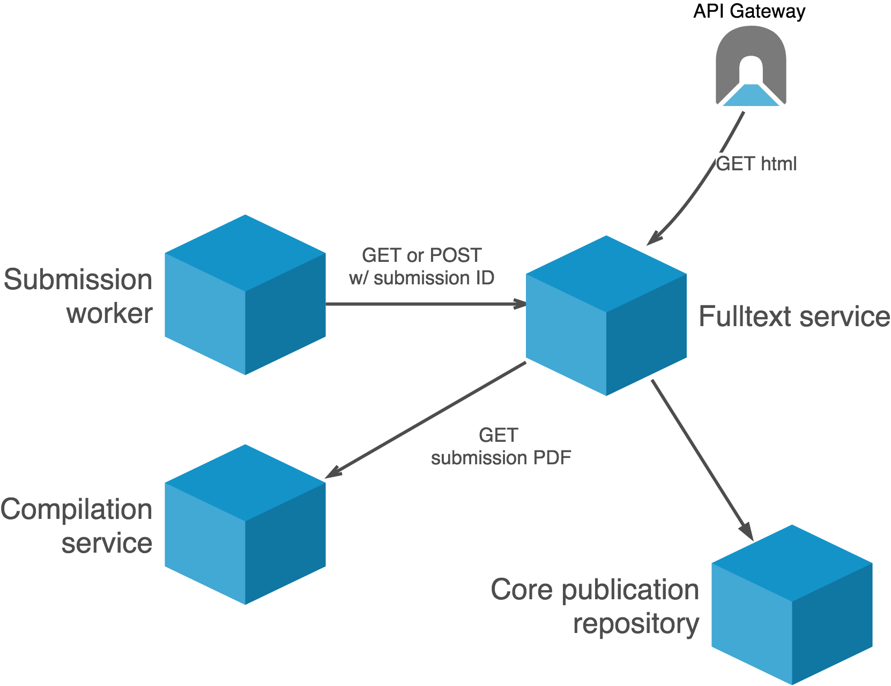
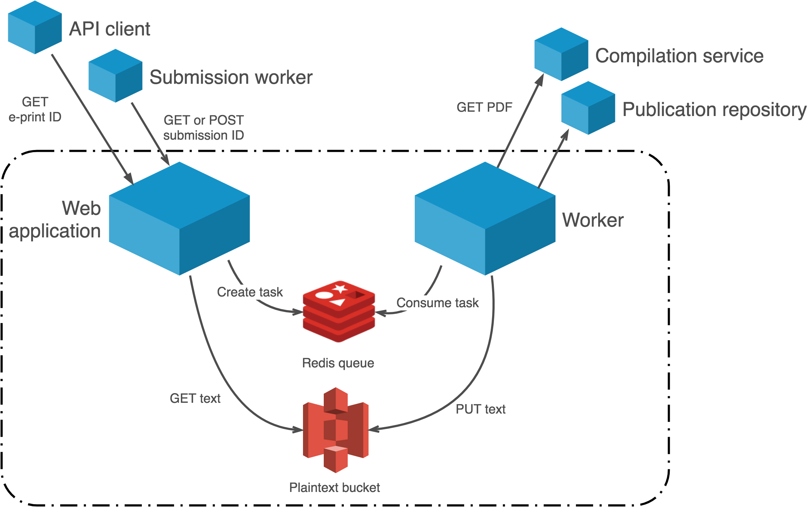

Architecture
============

Context
-------
The fulltext extraction service is used during the submission process as part
of QA/QC workflows, and after announcement to support indexing and other
downstream applications.

.. _figure-context:

   System context for the fulltext extraction service.

The submission worker process will request fulltext content for submissions by
making a GET request to the fulltext service. If an extraction for the
submission using the latest version of the extractor does not exist, the
service will retrieve the compiled PDF for the submission from the compilation
service and perform the extraction. The submission worker may force
re-extraction (e.g. if the submission content changes) by making a POST
request.

When a new e-print is announced, the publication process generates a
notification on a Kinesis stream that is consumed by the extraction service.
The extraction service retrieves the PDF for the e-print, performs the
extraction, and makes the result available via its API.

Clients (including both arXiv services and external API clients) may request
the latest extraction by making a GET request. If an extraction does not exist
for the paper using the most recent version of the extraction process, the
service retrieves the paper and performs the extraction.

Containers
----------
A web application implemented in Flask handles HTTP requests for
extractions. When the application cannot find a suitable extraction to fulfill
the request, or if re-extraction is forced via a POST request, it creates a
task for a worker process on a Redis queue (using Celery).

The worker process monitors the Redis queue, and does the work of retrieving
PDFs, performing extractions, and storing the results.

A lightweight relational database is used to track the extraction state of
submissions and announced e-prints. This helps to prevent duplicate extraction
tasks, and provides a high-level view of what extractions are available or
in progress. This is also leveraged to perform bulk re-extraction when
necessary.

Extractions are stored in a private S3 bucket, and organized by submission or
e-print ID and extractor version.

.. _figure-containers:

   Container-level view of the fulltext extraction service.
